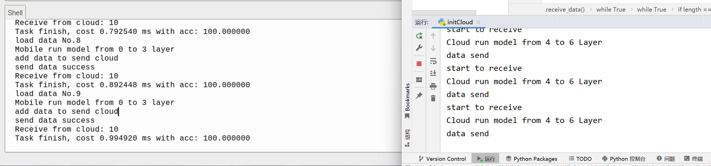

## 云边协同推理
>将主机作为云端，将树莓派作为边缘设备，部分计算部署在树莓派上，部分推理由云端进行，通过Socket完成树莓派和主机的通信，模拟的时候两者在统一子网下，需要两者能够相互ping通。

### 实验环境
python 3.9

### 使用方法
在边缘设备上运行`initMobile.py`，在服务器上运行`initCloud.py`即可实现。
本项目的主要目的是为了完成**云边协同推理**，实现语义分割模型的云边协同计算。

### 边缘设备
#### 数据结构
一个队列用于存放原始数据，一个队列用于存放边缘设备推理的半成品数据，一个队列用于存放最终结果。
#### 多进程
- 主进程（建立连接，test数据结果）
- 加载原始数据
- 模型推理
- 发送推理半成品
- 接收数据

### 云端
#### 数据结构
一个队列用于接收边缘设备的数据；一个队列用于模型推理结果需要发送给边缘设备的数据。
#### 多进程
- 主进程（发送数据）
- 接收数据
- 模型推理

### 说明
>本项目只是提供了云边推理的基本骨干结构，并不包含模型本身，可根据自身需求进行扩充。